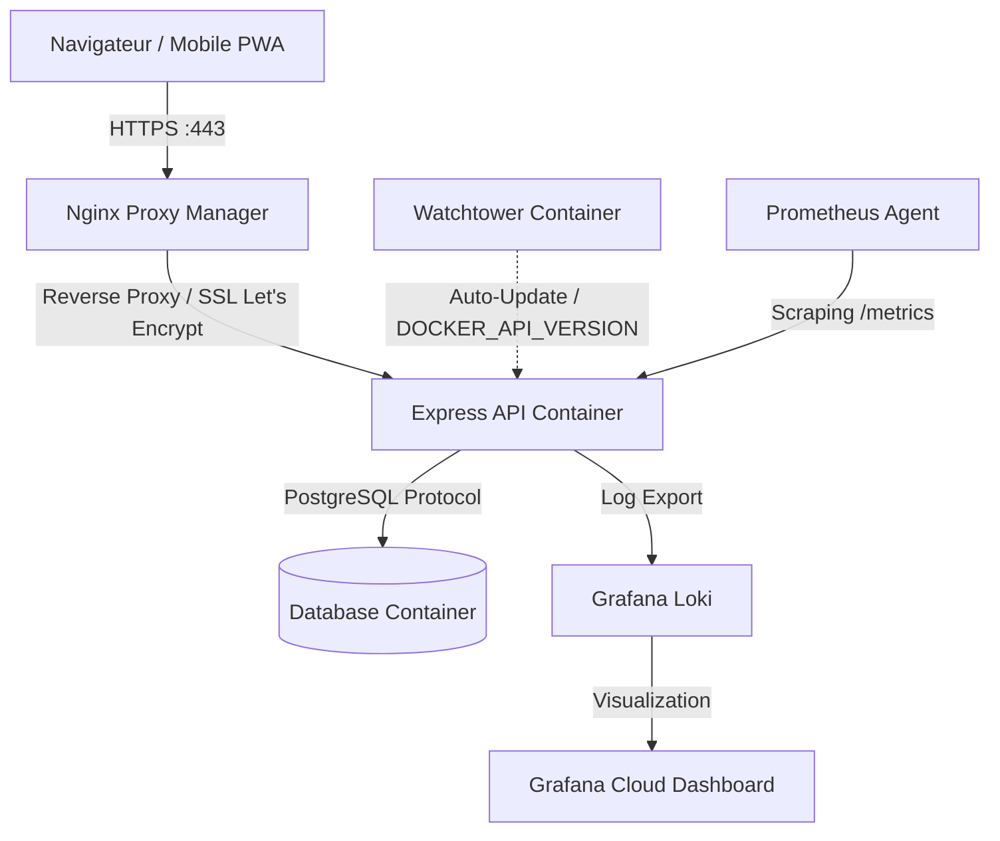

# Salut ! Moi c'est Antoine BATS 👋
### **Développeur Fullstack & DevOps** 🚀

*Passionné en ingénierie logicielle, spécialisé dans le développement d'applications web robustes et la mise en place d'architectures d'infrastructure sécurisées, auto-hébergées et monitorées.*

---

## 🟢 Production Status & Stats

  
  

---

## 💻 Mon HomeLab & Infrastructure Cloud Privée 🏠
*En dehors de mes cours, je gère et maintiens ma propre infrastructure de serveur privé (HomeLab) pour auto-héberger mes services quotidiens. C’est mon terrain d'expérimentation favori pour le réseau, la sécurité et la virtualisation.*

*   **Architecture & Conteneurisation** : Orchestration de **23 conteneurs Docker** actifs via Docker Compose sur un serveur privé Linux (NAS).
*   **Sécurité & Reverse Proxy** :
    *   Gestion du routage externe sécurisé via **Nginx Proxy Manager**.
    *   Génération et renouvellement automatique des certificats SSL/TLS **Let's Encrypt**.
    *   Gestionnaire de mots de passe auto-hébergé **Vaultwarden** (Bitwarden en Rust) avec chiffrement Zero-Knowledge de bout en bout.
*   **Réseau Privé & VPN** : Configuration d’un réseau maillé (Mesh VPN) sécurisé sous **Tailscale** pour l'accès à distance chiffré de mes machines et l'administration réseau sécurisée.
*   **Gestion des sauvegardes (Backup Strategy)** : Planification de sauvegardes automatiques, chiffrées et dédupliquées des volumes persistants des conteneurs via **Kopia**.
*   **Services Deployed** : **Immich** (sauvegarde de photos privée haute performance), **Home Assistant** (orchestration IoT & domotique), et un **Dashboard d'administration sur-mesure** développé en HTML/CSS pour centraliser l'accès et le monitoring (via Dozzle) de mes services.

---

## ⭐️ Projet Phare : **eSportCal** 🎮
**eSportCal** est une plateforme web et application mobile PWA qui centralise et planifie en temps réel les matchs de la scène professionnelle e-sport.

Développé en collaboration avec [Ilan](https://github.com/Ilnnn), ce projet collaboratif a servi de laboratoire pour concevoir une architecture **Fullstack** moderne et un pipeline **DevOps** d'excellence.

### 🛠️ Architecture Technique & Accomplissements :

#### **1. Frontend & Mobile (PWA)**
*   **Technologies** : React, Vite, Tailwind CSS.
*   **Expérience mobile** : Transformé en Progressive Web App (PWA) installable sur iOS/Android avec gestion du cache via Service Workers.
*   **Responsive design** : Interface adaptative sur mesure (disposition sur 2 lignes optimisée sur mobile/tablette, grille à 5 colonnes sur desktop).

#### **2. Backend & API**
*   **Technologies** : Node.js (Express), Socket.io, PostgreSQL, PandaScore API.
*   **Temps Réel** : Système de notification et de mise à jour des scores en direct via WebSockets.
*   **Automatisation** : Tâches Cron optimisées pour la synchronisation asynchrone des bases de données.

#### **3. DevOps, Sécurité & Observabilité (Le cœur de mon expertise)**
*   **Hébergement & CI/CD** : Déploiement hybride (Frontend sur Azure Static Web Apps ; API et base de données auto-hébergées sur mon NAS privé via Docker Compose).
*   **Automatisation du déploiement** : Pipeline Watchtower configuré sur le serveur pour des mises à jour continues d'images à chaque push GitHub.
*   **Sécurité maximale (Validée par des audits de sécurité publics)** :
    *   **Qualys SSL Labs** : Score **`A+`** (Sécurisation des flux via NPM, algorithmes de chiffrement modernes ECDSA 384).
    *   **Security Headers** : Score **`A`** (Implémentation stricte de CSP, HSTS, X-Frame-Options, Referrer-Policy, Permissions-Policy).
    *   **Mozilla Observatory** : Score **`B+`** (Politique de sécurité de contenu (CSP) robuste).
*   **Observabilité & Alerting** : Configuration d'un agent de monitoring Prometheus collectant des métriques applicatives système, avec centralisation des logs applicatifs (Grafana Loki) vers un tableau de bord Grafana Cloud unifié.

---

## ⚙️ Méthodologie & Bonnes Pratiques
*   **Git Workflow** : Utilisation stricte de Pull Requests (PR) avec séparation d'environnements (`main`, `staging`, `dev`).
*   **Conventional Commits** : Messages de commit standardisés et sémantiques (`feat:`, `fix:`, `chore:`, `style:`, `docs:`) pour une traçabilité claire de l'historique de développement.

---

## 🛠 Langages et Technologies

### **Développement Web & Logiciel**

  
  
  
  
  
  
  

### **DevOps, Système & Outils**

  
  
  
  
  
  

---

## 📊 Statistiques GitHub

---

## 📁 Autres Projets
*   **[Fluxify](https://github.com/loties1533/bordeaux-safesim)** : Projet collaboratif de simulation de montée des eaux.
*   **[HBnB](https://github.com/add1ktion/holbertonschool-hbnb)** : Clone complet d'AirBnB développé en Python (Flask, API RESTful, MySQL).
*   **[Simple Shell](https://github.com/add1ktion/holbertonschool-shell)** : Recréation en C d'un shell Unix fonctionnel, avec gestion des processus et parseur de commandes personnalisé.

---

## 📬 Me Contacter
*   **LinkedIn** : [in/antoine-bats](https://linkedin.com/in/antoine-bats) 💼
*   **Email** : [antoine.bats@gmail.com](mailto:antoine.bats@gmail.com) ✉️

---

<i>"Building performant code, securing systems, monitoring everything."</i>

